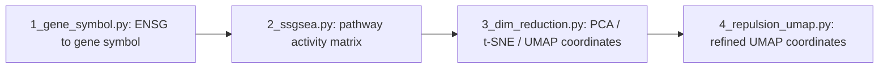

# Pathway Space Construction

This folder contains the pipeline for building a **pathway space** (2D coordinates) for a TCGA cancer cohort.

Each pathway is represented as a high-dimensional activity vector (its ssGSEA scores across the samples). The pipeline projects these vectors into 2D with PCA / t-SNE / UMAP and then refines the UMAP coordinates with a repulsion model, so the resulting coordinates can be used downstream (e.g., to build pathway images / matrices for the PathSynergy model).

> **Note:** The cancer type is left as the placeholder `{CANCER}`. Before running, replace every `{CANCER}` with your cancer type (e.g. `LIHC`, `COAD`). Sample / pathway counts are intentionally not hardcoded.

## Data Flow

## Files

### 1_gene_symbol.py — Gene ID conversion
- Converts Ensembl gene IDs (`ENSG...`) to gene symbols using `mygene`.
- Input: `TCGA-{CANCER}_TPM_data_clean.csv` (gene_id x samples)
- Output: `TCGA-{CANCER}_TPM_data_symbol.csv` (adds a `gene_symbol` column)

### 2_ssgsea.py — ssGSEA pathway activity scoring
- Computes per-sample ssGSEA enrichment scores with `gseapy`.
- Input: `TCGA-{CANCER}_TPM_data_symbol.csv` + a GMT pathway file (`c2.cp.v2023.1.Hs.symbols.gmt`)
- Output: `TCGA-{CANCER}_ssGSEA_scores.csv` (pathway x sample matrix) and the long-format `TCGA-{CANCER}_ssGSEA_scores_long.csv`

### 3_dim_reduction.py — Pathway dimensionality reduction
- Treats each pathway as a high-dimensional vector (activity across the samples), standardizes it, and projects it into 2D with PCA, t-SNE, and UMAP.
- Input: `TCGA-{CANCER}_ssGSEA_scores.csv`
- Output: `TCGA-{CANCER}_pathway_dim_reduction.csv` (`pathway`, `PCA_1/2`, `tSNE_1/2`, `UMAP_1/2`), plus `PCA_variance.txt` and visualization PNGs

### 4_repulsion_umap.py — Repulsion refinement of UMAP coordinates
- Fine-tunes the UMAP coordinates with a pure repulsion model (all points repel each other) to reduce pixel overlap, without stretching the Y axis.
- Input: `TCGA-{CANCER}_pathway_dim_reduction.csv` (`UMAP_1`, `UMAP_2`)
- Output (in `repulsion_umap/`): `refined_umap.csv`, `overlap_comparison.csv`, `before_after_scatter.png`, `before_after_heatmap.png`

## Key Intermediate Artifacts

| File | Description |
|------|-------------|
| `TCGA-{CANCER}_TPM_data_symbol.csv` | Expression matrix with gene symbols |
| `TCGA-{CANCER}_ssGSEA_scores.csv` | Pathway activity matrix (pathway x sample) |
| `TCGA-{CANCER}_pathway_dim_reduction.csv` | 2D coordinates for all pathways (PCA / t-SNE / UMAP) |
| `repulsion_umap/refined_umap.csv` | Final refined UMAP coordinates |

